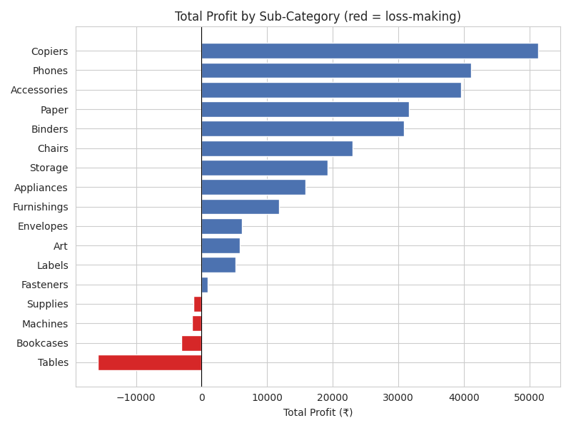
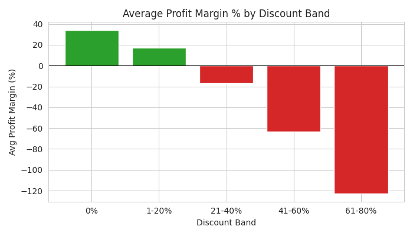

📊 Retail Sales & Profitability Analytics

An end-to-end analytics project that digs into ~10,000 retail orders to find out where a business is actually making and losing money — and turns that into concrete recommendations, not just charts.

🔗 Live Dashboard: your-app-name.streamlit.app (replace after deploying)

🧩 The Problem

A retail business can have healthy total sales while quietly losing money on a subset of orders — and without breaking profit down by discount level, category, and region, that pattern stays invisible. This project finds exactly where and why profit leaks.

🔍 Key Findings
Finding	Business Impact
Discounts above ~20% flip average profit margin negative — down to -122.7% at 60-80% discount	Recommend capping discounts around 20%
Tables sub-category lost ₹15,871 overall — the single biggest loss	Needs a dedicated pricing/discount review
Central region's margin (7.5%) is roughly half of West's (15%)	Worth comparing discount practices between regions
Copiers, Phones, and Accessories are the most profitable sub-categories	Protect these from blanket discount changes
Home Office segment has the highest margin (13.6%) despite lower total sales than Consumer	Consider shifting marketing weight toward Home Office

(See interview_prep.md for the full breakdown and reasoning behind each.)

📈 Screenshots

   

🛠️ Tech Stack

Python · pandas · matplotlib / seaborn · Streamlit

📁 Project Structure
├── app.py                       # Streamlit dashboard
├── superstore_analysis.ipynb    # Full analysis notebook (cleaning → EDA → viz → recommendations)
├── superstore_clean.csv         # Cleaned dataset
├── superstore_raw.csv           # Original raw dataset
├── requirements.txt             # Dependencies
├── chart1-5_*.png               # Exported chart images
└── interview_prep.md            # Project write-up and Q&A notes
⚙️ Run It Locally
bash
git clone https://github.com/<your-username>/<your-repo>.git
cd <your-repo>
pip install -r requirements.txt
streamlit run app.py

🔬 Approach
Load & explore — checked shape, dtypes, missing values, duplicates.
Clean — dropped ~2% of rows missing core financial data (unsafe to impute), converted dates, engineered Profit Margin / Order Month-Year / Shipping Days.
Analyze — pandas groupby/pivot across Region, Category, Discount level, time, and Customer Segment.
Visualize — one chart per finding, color-coded for profit vs. loss.
Recommend — translated each chart into a specific, defensible action.
Deploy — packaged the analysis into an interactive Streamlit dashboard.
⚠️ Limitation

This shows correlation, not proof of causation — discount level and profit margin move together, but factors like which products get discounted or seasonal clearance timing haven't been ruled out. Next step: check discount reasons before recommending a hard policy change.

🚀 Future Improvements
Investigate the root cause behind high-discount orders (clearance? rep discretion? bulk orders?)
Add a date-range filter and year-over-year comparison to the dashboard
Explore a regression model to quantify how much of profit variance discount explains vs. other factors
Add customer-level analysis (repeat customers, lifetime value)
